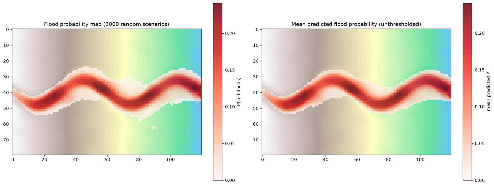

# Localized Flood Extent Prediction and Risk Mapping



A small research-style project simulating localized flooding in a
synthetic watershed, and training a surrogate model to predict flood
extent from a scenario's location and severity alone. The trained
surrogate is then used to sweep across thousands of hypothetical
scenarios and build a probabilistic flood-risk map — not "what floods in
this one event," but "how often does each part of the watershed flood,
across everything that could plausibly happen."

Nothing here uses a real watershed or real rainfall data. The terrain,
the physics, and the severities are all synthetic, generated the same
way throughout so results are directly comparable to one another. The
point of the project is the modeling approach — how to represent a
spreading physical event as network input, how to train on a rare-event
target without the model just learning to ignore it, and how to turn a
single-scenario predictor into a risk map — not a claim about any real
place.

## Running it

```
pip install -r requirements.txt
python main.py          # trains and evaluates the surrogate, saves the model
python monte_carlo.py   # runs the Monte Carlo sweep using the saved model
```

`main.py` takes a few minutes (120 training epochs) and saves the trained
model to `flood_surrogate_model.keras`. `monte_carlo.py` loads that saved
model — it does not retrain — and writes `flood_risk_map.png`.

Training is seeded (`keras.utils.set_random_seed(0)` plus TensorFlow's
deterministic-ops mode), so re-running `main.py` on the same machine
reproduces the numbers below exactly. `requirements.txt` pins the exact
library versions they were produced with; other versions (TensorFlow in
particular) may shift the results slightly.

## Files

| File | What it does |
|---|---|
| `terrain.py` | Builds a synthetic watershed: a general downhill slope, a meandering channel carved into it, and smoothed random noise. Returns a 2D elevation grid. |
| `flood_sim.py` | The physics: a localized flood originates at one point along the channel and spreads outward, but the water-level rise decays with distance from the source rather than staying constant, so the search naturally stops once there is nothing meaningful left to give. Also generates random (location, severity) scenarios and their true flooded masks. |
| `surrogate.py` | A fully convolutional neural network that predicts the same flooded/dry mask directly from three inputs per cell: elevation, distance from the source, and severity (broadcast to every cell). Trained with a combined crossentropy + Dice loss so the rare flooded cells actually drive learning. |
| `evaluate.py` | Scores the surrogate against the real physics on held-out scenarios using IoU and Dice (region-overlap metrics, not simple per-cell accuracy). |
| `main.py` | Builds the terrain, generates training/test scenarios, trains the surrogate, evaluates it, and saves the trained model. |
| `monte_carlo.py` | Loads the saved surrogate and runs it on thousands of random scenarios, aggregating the results into a per-cell flood-probability map. |

## The physics: a localized, decaying flood

A flood in this project starts at one point along the channel (a stand-in
for a culvert constriction, a tributary joining, or a burst of localized
rain) and spreads to neighbouring cells that are both connected to the
source and below the local water level.

The water-level rise at the source decays with distance from it
(`rise = severity × exp(-steps / decay_length)`), rather than holding the
same level indefinitely far away, because real floodwater loses height as
it spreads and travels. The search stops on its own once that decayed
rise becomes negligible, so nothing needs an arbitrary step limit for the
spread to stay bounded. Connectivity still does real work within that
range — a genuine barrier in the terrain blocks a path, if one exists —
so a cell floods only when it is both reachable and still below the
decayed local water level at that distance.

## The surrogate: predicting flood extent directly

The surrogate takes three per-cell channels — elevation, distance from
the source, and the scenario's severity broadcast to every cell — and
outputs a flood probability per cell, using only convolutional layers (no
flattening), so a cell's prediction only ever depends on information
actually near it.

### Why Dice loss

Only about 2.2% of any grid is actually flooded in a given scenario.
Plain binary crossentropy scores every cell on its own and averages over
all of them, treating a correct dry cell exactly like a correct flooded
one. With 98% of cells dry, a model can reach a very low loss just by
being right about the dry majority: one that predicts a 2% flood chance
everywhere — finding no flooding at all — already scores a crossentropy
of about 0.1.

Dice loss has no such escape hatch. It is 1 − the Dice score, which
measures only the overlap between the predicted and true flooded areas:

```
Dice = 2 × |predicted ∩ true| / (|predicted| + |true|)
```

In code, with `y_true` (0 = dry, 1 = flooded) and `y_pred` (the
network's flood probability per cell):

- `|predicted ∩ true|` = sum of `y_true × y_pred`
- `|predicted|` = sum of `y_pred`
- `|true|` = sum of `y_true`

The 2 is part of the standard definition. It makes a perfect prediction
score exactly 1, since the overlap then equals |true| and the denominator
is 2 × |true|.

#### How each kind of cell affects the score

A six-cell example covering every case:

| Cell | `y_true` | `y_pred` | Case | Adds to overlap | Adds to \|predicted\| | Adds to \|true\| |
|---|---|---|---|---|---|---|
| 1 | 1 | 0.9 | flooded, predicted flooded | 0.9 | 0.9 | 1 |
| 2 | 1 | 0.6 | flooded, predicted unsure | 0.6 | 0.6 | 1 |
| 3 | 1 | 0.0 | flooded, missed | 0 | 0 | 1 |
| 4 | 0 | 0.3 | dry, false alarm | 0 | 0.3 | 0 |
| 5 | 0 | 0.0 | dry, predicted dry | 0 | 0 | 0 |
| 6 | 0 | 0.0 | dry, predicted dry | 0 | 0 | 0 |
| | | | **Total** | **1.5** | **1.8** | **3** |

```
Dice = 2 × 1.5 / (1.8 + 3) = 3.0 / 4.8 = 0.625
```

- **Correctly predicted dry cells (5, 6)** are completely neutral. They
  add 0 to the numerator and 0 to the denominator, since both `y_true`
  and `y_pred` are 0. Adding a thousand more of them would leave the
  score at 0.625. This is what stops the dry majority from inflating it.
- **False alarms (4)**, a dry cell with a non-zero prediction, add
  nothing to the overlap, since they are multiplied by the true 0, but
  add their full value to |predicted|, lowering the score. The penalty
  scales with confidence, so 0.3 counts as 0.3 of a false alarm.
  Predicting 0 there instead raises Dice to 3.0 / 4.5 = 0.667.
- **Correctly predicted flooded cells (1, 2)** add `1 × y_pred` to the
  overlap, so a confident 0.9 earns more than an unsure 0.6.
- **Missed flooded cells (3)** still add 1 to |true| but nothing to the
  overlap, so the score loses what it could have gained. Predicting 1
  there instead raises Dice to 5.0 / 5.8 = 0.862.

Dice reaches 1 only with no false alarms and no misses. The lazy "2%
flood chance everywhere" model from above, which crossentropy scored at
about 0.1 loss, gets a Dice score of about 0.02 (a Dice loss of 0.98).

The network is trained on crossentropy + Dice combined: crossentropy
gives a stable cell-by-cell training signal, especially early on, and
Dice keeps the rare flooded cells from being ignored.

Two implementation details in `dice_loss`: the score is computed over the
whole training batch at once (every cell of every scenario in the batch,
flattened together), and a small `smooth` term is added to the top and
bottom of the fraction so a batch with no flooding doesn't divide by zero.

### Results

Evaluated on 80 held-out test scenarios (scored with IoU and Dice, not
plain per-cell accuracy, since the dry majority would make accuracy
misleadingly high on its own):

| | Value |
|---|---|
| Mean IoU | 0.869 |
| Mean Dice | 0.929 |
| Worst-case IoU | 0.736 |
| Best-case IoU | 0.953 |

These are from the seeded run. Training is sensitive to the random seed:
across three unseeded runs, mean IoU ranged 0.834–0.856, mean Dice
0.908–0.921, and worst-case IoU swung widely, 0.571–0.675 — so the seeded
run above is on the good end, and the worst-case figure in particular
should not be read as a stable property of the model.


## From single predictions to a risk map

A single simulation, physics or surrogate, only ever answers "what floods
in this one event." `monte_carlo.py` asks a different question: draw a
large number of random plausible events — random location along the
channel, random severity — run each one through the surrogate, and for
every cell, count what fraction of those events actually flooded it. That
per-cell fraction is a flood probability, and together they form a
hazard/risk map rather than a single scenario's outcome.

Over 2,000 random draws:

- The highest-risk single cell flooded in 24.1% of draws.
- 9.9% of the grid (948 of 9,600 cells) has more than a 1-in-10 chance of
  flooding across plausible events.
- Risk is highest along the channel itself and fades smoothly toward the
  banks, matching the terrain rather than looking arbitrary.

## Honest limitations

Everything here is synthetic — the terrain, the severities, and the
resulting risk map are not calibrated to any real place or real rainfall
data, and cannot be used to say whether this watershed is more or less
"safe" than a real one. The risk map also only measures the *hazard*
(how often water shows up somewhere), not exposure or vulnerability —
whether anything of value (a road, a building, people) is actually there
to be affected, which real flood-risk assessment also requires and which
this project does not model.

The surrogate's remaining errors are not uniform: the worst held-out
scenario still only reaches an IoU of 0.736 in the seeded run (and as
low as 0.571 in unseeded runs), and the thresholded Monte Carlo map shows
a visibly ragged, speckled probability estimate along the channel banks
around columns 70–80, plus a small detached cluster of predicted-flooded
cells well off the channel (near row 61, column 90) — signs that some
scenarios remain harder for the model than others, not yet diagnosed
further. The model was also only trained and evaluated on one fixed
terrain; whether it generalises to a differently shaped watershed without
retraining has not been tested.
